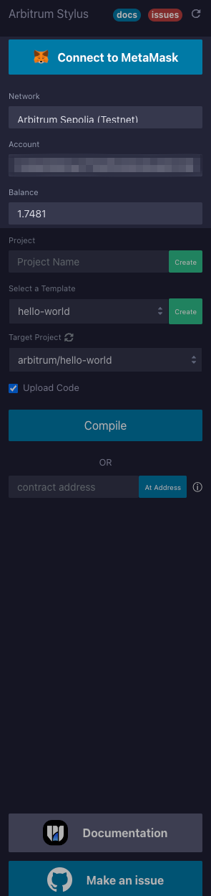
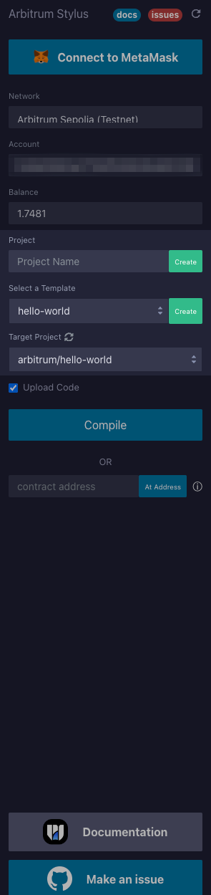
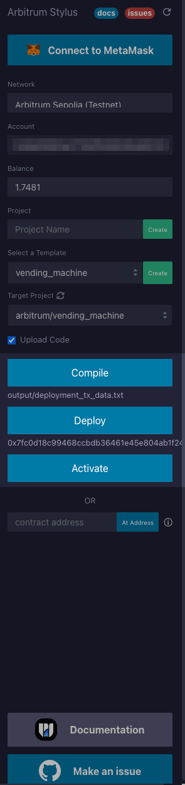
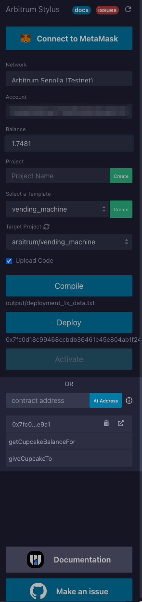

<div align="center">
  <h1>Arbitrum Stylus Remix Plugin by WELLDONE Studio</h1>
</div>

<!-- markdownlint-disable -->
<div align="center">
  
</div>

<div align="center">
  
[](https://remix.ethereum.org/#activate=arbitrum-stylus)

</div>

Wellcome to the Arbitrum stylus remix plugin repository.

This tool is the best solution for deploying smart contracts written in languages like Rust through Arbitrum Stylus in Remix IDE. As long as you write your smart contract in a language that can be compiled to WASM here, you will be able to compile, deploy, activate, and even directly execute the contract through Stylus.


<details> 
<summary>Table of Contents</summary>

- [Arbitrum Stylus Remix Plugin by WELLDONE Studio](#arbitrum-stylus-remix-plugin-by-welldone-studio)
  - [Installation and Setup](#installation-and-setup)
    - Installation
    - Usage
  - [Usage](#usage)
    - [Running the Plugin](#running-the-plugin)
    - [Writing a Smart Contract](#writing-a-smart-contract)
    - [Deploying and Activating the Smart Contract](#deploying-and-activating-the-smart-contract)
    - [Interacting with the Smart Contract](#interacting-with-the-smart-contract)
</details>

### Installation and Setup

1. Installation: You don't need to install anything. If you want to use our plugin, simply go to the plugin manager in [Remix IDE](https://remix.ethereum.org/) and search for "Arbitrum Stylus." If you prefer to use it without searching, you can click [this direct link](https://remix.ethereum.org/#activate=arbitrum-stylus) for a faster and easier experience.

2. Usage: Once you access the plugin, your wallet will automatically connect. After that, users can either write their own contracts or load examples of pre-written contracts through the templates provided. For more detailed information, please refer to the usage section below.

### Usages

<div>
  
  
</div>

#### Running the Plugin
1. Activate the plugin in Remix IDE. You can either access it via [this direct link](https://remix.ethereum.org/#activate=arbitrum-stylus) or go to the plugin manager in Remix IDE and search for "Arbitrum Stylus" to activate it.
2. Upon accessing, the wallet address and balance can be automatically retrieved through MetaMask connected to the Arbitrum network. If MetaMask is not connected to the Arbitrum network, it will automatically switch to the mainnet. If the mainnet information is not available, it will be automatically added.

#### Writing a Smart Contract
1. Create a new project under the arbitrum/ directory, or use the "Create Template" option to automatically generate a Rust-based project.
2. **Create Template**: Create a simple example contract code written in Rust. You can create a sample contract by selecting the template option and clicking the `Create` button. More templates may be found at [Stylus Samples](https://github.com/OffchainLabs/stylus-workshop-rust-solidity).
3. **New Project**: Automatically generate a contract structure. Click the `Create` button to create a contract structure.
4. **Create Manually**: You can create your own contract projects without using the features above. However, for the remix plugin to build and deploy the contract, it must be built within the directory `arbitrum/`. If you start a new project, the structure should look like the following.
```
arbitrum
└── <YOUR_PROJECT_NAME>
    ├── Cargo.toml
    └── src
        └── contract.rs
    └── examples
        └── schema.rs
```
5. Write your smart contract in a language supported by Arbitrum Stylus
6. Once the smart contract code is complete, select the contract you wish to deploy from the target template and click the Compile button. After compilation, the bytecode for deployment will be generated as a deployment_tx_data.txt file in the output folder of the respective directory.



#### Compile the Contract
1. Select the project you want to compile in the **TARGET PROJECT** section.
2. Select a compilation option and click the `Compile` button.
3. When the compilation is complete, a tx_data and abi files are returned.

#### Deploying and Activating the Smart Contract
1. Once the contract is successfully compiled, a Deploy button will appear below the Compile button. Click the Deploy button to deploy your contract.
2. After a successful deployment, the contract address will be displayed below the button, allowing you to check the deployed contract on an explorer.
3. If activation is required, click the Activate button to send an activation transaction, which is necessary to use the contract. If the contract is already activated, an interaction tab will be available for you to start interacting with the contract.



####  Interacting with the Smart Contract
1. You can interact with the deployed smart contract through the Contracts section in the Remix IDE plugin.
2. Once deployment or activation is complete, an interaction tab will be generated in the Contracts section, where you can see all the contracts you have deployed.
3. Alternatively, you can manually register the contract by entering the address and ABI directly.
4. You can select the desired contract to interact with. The most recently deployed contract address will be shown below the deploy button, so you can find the corresponding contract tab to interact with it.
5. The list of functions in the contract will be displayed, and you can provide input values and invoke the functions as needed.
